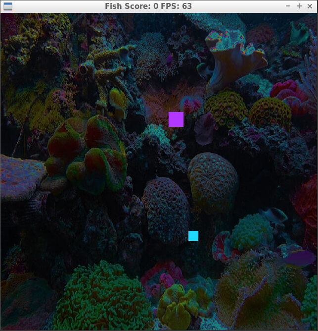

# CPPND: Capstone Fish Game

This project uses the starter repo for the Capstone project in the [Udacity C++ Nanodegree Program](https://www.udacity.com/course/c-plus-plus-nanodegree--nd213). The code for this repo was inspired by [this](https://codereview.stackexchange.com/questions/212296/snake-game-in-c-with-sdl) excellent StackOverflow post and set of responses.

The SnakeGame has been refactored to be a Fish game.  The Player is able to eat smaller fish and grow larger, but if the player attempts to eat a fish larger than themselves they be eaten.

## Code Breakdown:
* snake.h and snake.cpp contains the refactored Fish class which has been changed to allow the Fish to grow when it eats fish_food.
* fish_food.h and fish_food.cpp contains the Fish_Food class that was created using the rule of 5.  The Fish_Food class contains private data members and public member functions that can be used to interact with the class variables.
* renderer.h and renderer.cpp has been updated to render a background image and handle rendering the new Fish_Food object.
* game.h and game.cpp have been updated with new variables and functions to work with the new Fish class.
	* Game::Run has been updated to terminate the game once the player fish is killed.  Functionality has also been added to place a new fish_food allowing the user to avoid eating fish they cannot eat.
    * Game::Place_Food has been updated to randomly select a food size.
    * Game::ConvPxGrid has been added to allow for more readable calculations.
    * Game::CollDetect has been added to calculate collision for Fish and Fish_Food objects
    * Game::Update has been updated to use the CollDetect function for food detection
* all files have been updated to use the new fish objects instead of snake.

## Ruberic Items:
* The project demonstrates an understanding of C++ functions and control structures.
	* fish_food.cpp line# 23, 28
    * renderer.cpp line# 55-72, 89-105
    * game.cpp line# 37-44, 64-66, 78-80, 85-89, 91-110
* The project reads data from a file and process the data, or the program writes data to a file.
	* renderer.h line# 23, 29
    * renderer.cpp line# 89-106
* The project uses Object Oriented Programming techniques.
	* fish_food.h line# 1-21
    * fish_food.cpp line# 1-31
    * game.h line# 24-26, 18, 19
    * game.cpp  line# 85-89, 91-110
    * renderer.h line# 23, 29
    * renderer.cpp line# 89-106
* Classes use appropriate access specifiers for class members.
	* fish_food.h line# 1-21
    * fish_food.cpp line# 1-31
* Class constructors utilize member initialization lists.
	* fish_food.cpp line# 4-6, 8-10, 14-16
* Classes abstract implementation details from their interfaces.
	* fish_food.h line# 14, 15
    * fish_food.cpp line# 23-26, 28-31
    * renderer.h line# 23
    * renderer.cpp line# 89-106
    * game.h line# 18, 19, 24, 25, 26
    * game.cpp line# 85-89, 91-110
* The project follows the Rule of 5.
	* fish_food.h line# 1-21
    * fish_food.cpp line# 1-31

## Dependencies for Running Locally
* cmake >= 3.7
  * All OSes: [click here for installation instructions](https://cmake.org/install/)
* make >= 4.1 (Linux, Mac), 3.81 (Windows)
  * Linux: make is installed by default on most Linux distros
  * Mac: [install Xcode command line tools to get make](https://developer.apple.com/xcode/features/)
  * Windows: [Click here for installation instructions](http://gnuwin32.sourceforge.net/packages/make.htm)
* SDL2 >= 2.0
  * All installation instructions can be found [here](https://wiki.libsdl.org/Installation)
  * Note that for Linux, an `apt` or `apt-get` installation is preferred to building from source.
* gcc/g++ >= 5.4
  * Linux: gcc / g++ is installed by default on most Linux distros
  * Mac: same deal as make - [install Xcode command line tools](https://developer.apple.com/xcode/features/)
  * Windows: recommend using [MinGW](http://www.mingw.org/)
 * SDL2_image
	* https://gist.github.com/BoredBored/3187339a99f7786c25075d4d9c80fad5
	* #install sdl image
	* sudo apt install libjpeg9-dev libwebp-dev libtiff5-dev libsdl2-image-dev libsdl2-image-2.0-0 -y;

## Basic Build Instructions
1. Clone this repo.
2. Make a build directory in the top level directory: `mkdir build && cd build`
3. Compile: `cmake .. && make`
4. Run it: `./SnakeGame`.